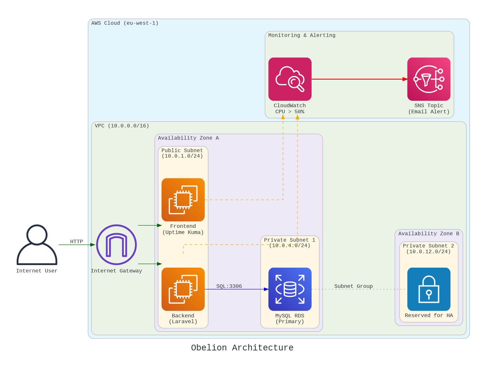

# 🚀 Obelion Cloud Assessment Solution

This repository contains a complete, automated cloud infrastructure solution designed for the Obelion technical assessment. It demonstrates **Infrastructure as Code (IaC)**, **CI/CD Automation**, and **Cloud Monitoring** best practices on AWS.

## 📋 Project Scope

| Task Group | Focus Area | Status | Implementation Details |
| :--- | :--- | :--- | :--- |
| **A** | **Infrastructure** | ✅ Done | AWS VPC, EC2, Private RDS (MySQL) via Terraform. |
| **B** | **Automation (CI/CD)** | ✅ Done | GitHub Actions for Uptime Kuma (Docker) & Laravel (LEMP). |
| **B** | **Monitoring** | ✅ Done | CPU Alerting via CloudWatch & SNS. |
| **C** | **Migration** | 📝 Plan | Strategic plan for Azure migration (Zero-Downtime). |

---

## 📂 Repository Structure

```text
.
├── 01-infrastructure/   # Terraform Source Code (AWS Resources)
├── 05-keys/             # SSH Keys storage (Gitignored for security)
├── docs/                # Detailed Technical Reports & Evidence
│   ├── images/          # Proof of execution screenshots
│   ├── 01-infrastructure.md
│   ├── 02-cicd-automation.md
│   ├── 03-monitoring-alerting.md
│   └── 04-azure-migration-plan.md
├── Makefile             # One-click automation tool
└── README.md            # Project Entry Point
```

---

## 🏗️ Architecture Design

The solution implements a secure 3-Tier architecture inside a custom VPC.



---

## 🛠️ Prerequisites

To run the automation suite, ensure you have the following installed:

*   **Terraform** (v1.0+)
*   **AWS CLI** (Configured with credentials)
*   **GitHub CLI (`gh`)** (Crucial for syncing secrets automatically)
*   **Make** (To run the helper commands)

---

## ⚡ Quick Start (Automation)

This project uses a `Makefile` to abstract complex commands. Follow these steps to deploy everything from scratch.

### 1. Setup & Provisioning
First, generate security keys and provision the AWS infrastructure.

```bash
# 1. Generate SSH Key Pair (RSA 4096)
make keygen

# 2. Initialize Terraform modules
make init

# 3. Plan & Apply Infrastructure
# (This creates VPC, EC2s, RDS, and Security Groups)
make apply
```

### 2. Application Deployment (CI/CD)
Instead of manual installation, we trigger GitHub Actions. The Makefile will automatically upload the new AWS IPs and SSH Keys to GitHub Secrets.

```bash
# Deploy Frontend (Uptime Kuma)
make gh-deploy-frontend

# Deploy Backend (Laravel + Migrations)
make gh-deploy-backend
```

### 3. Server Access & Testing
Access the servers securely using the generated keys.

```bash
# SSH into Frontend Server
make ssh-frontend

# SSH into Backend Server
make ssh-backend
```

---

## 📖 Detailed Documentation

For deep dives into the decisions, code logic, and proof of execution, please refer to the `docs/` folder:

1.  [**Infrastructure Report**](./docs/01-infrastructure.md) - Details on VPC, Security Groups, and RDS isolation.
2.  [**CI/CD & Automation**](./docs/02-cicd-automation.md) - Explanation of GitHub Actions workflows and secrets management.
3.  [**Monitoring Strategy**](./docs/03-monitoring-alerting.md) - How we configured CloudWatch Alarms and stress-tested the CPU.
4.  [**Azure Migration Plan**](./04-documentation/azure-migration-plan_database.md) - A consultancy-grade plan for migrating to Azure.

---

## 🧹 Clean Up

To avoid unnecessary AWS costs, destroy the infrastructure when finished:

```bash
make destroy
```

