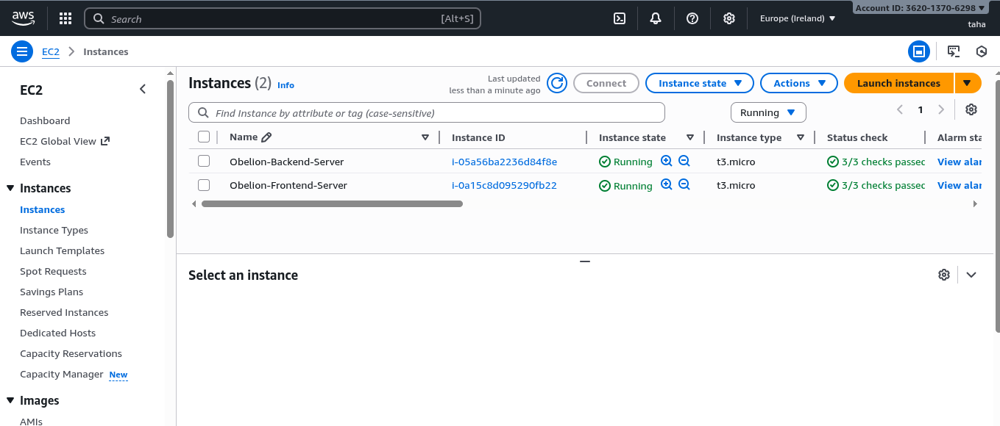
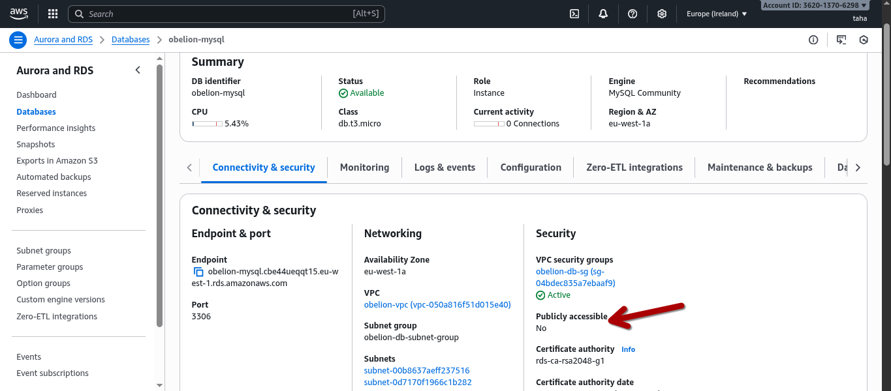

# Task Group A: Infrastructure Provisioning & Architecture Report

## 1. Executive Summary
This document details the technical implementation of the cloud infrastructure provisioned for the Obelion assessment. The objective was to design and deploy a secure, scalable, and automated environment on **AWS** capable of hosting a decoupled web application (Frontend: Uptime Kuma, Backend: Laravel) backed by a relational database.

The infrastructure was orchestrated using **Terraform** (Infrastructure as Code), ensuring idempotency, version control, and rapid disaster recovery.

---

## 2. High-Level Architecture
The architecture follows the standard **3-Tier Web Application pattern**, adapted for cloud-native best practices. The network design ensures a strict separation of concerns, isolating the persistence layer (Database) from the public internet while allowing the application layers to handle traffic securely.

### Architecture Diagram
The following diagram illustrates the network topology, traffic flow, and logical isolation of resources:

---

## 3. Network Design (VPC Strategy)
We established a custom Virtual Private Cloud (VPC) to provide a completely isolated network environment, avoiding the security risks associated with the Default VPC.

*   **VPC CIDR:** `10.0.0.0/16` (Provides up to 65,536 IP addresses, ensuring scalability).
*   **Availability Zones (AZs):** The infrastructure spans multiple AZs within the `eu-west-1` region to support high availability requirements for the RDS Subnet Group.

### Subnet Segmentation
To enforce security at the network level, we implemented a tiered subnet strategy:

| Subnet Type | CIDR Block | Access Level | Purpose |
| :--- | :--- | :--- | :--- |
| **Public Subnet** | `10.0.1.0/24` | **Public** | Hosts the Frontend and Backend EC2 instances. Contains an Internet Gateway (IGW) route to allow incoming HTTP/SSH traffic. |
| **Private Subnet 1** | `10.0.4.0/24` | **Restricted** | Hosts the Primary RDS Database instance. **No direct internet access.** |
| **Private Subnet 2** | `10.0.12.0/24`| **Restricted** | Reserved for RDS High Availability (Multi-AZ) requirements. |

---

## 4. Compute Resources (EC2)
Two EC2 instances were provisioned running **Ubuntu 22.04 LTS**. While both possess Public IPs as per the assessment requirements, access is strictly governed by Security Groups.

### A. Frontend Server (Uptime Kuma)
*   **Instance Type:** `t3.micro` (1 vCPU, 1 GB RAM).
*   **Storage:** 8 GB GP3 (General Purpose SSD).
*   **Provisioning Strategy:**
    *   Utilized **User Data** scripts to automatically install `Docker` and `Docker Compose` upon first boot.
    *   This "Infrastructure-as-Code" approach eliminates the need for manual server configuration.

### B. Backend Server (Laravel API)
*   **Instance Type:** `t3.micro` (1 vCPU, 1 GB RAM).
*   **Storage:** 8 GB GP3.
*   **Provisioning Strategy:**
    *   **LEMP Stack Automation:** The User Data script automatically provisions **Nginx**, **PHP 8.2**, **Composer**, and required PHP extensions (`bcmath`, `xml`, `mysql`, `curl`).
    *   Directory permissions (`/var/www/html`) were pre-configured to allow the `ubuntu` user (and CI/CD pipelines) to deploy code without permission issues.

---

## 5. Database Layer (RDS MySQL)
The persistence layer utilizes **Amazon RDS (Relational Database Service)** to leverage managed backups, patching, and scaling capabilities.

*   **Engine:** MySQL Community Edition v8.0.
*   **Instance Class:** `db.t3.micro` (Free Tier eligible).
*   **Security Configuration (Critical):**
    *   **Publicly Accessible:** `No`. The database endpoint cannot be resolved or accessed from the public internet.
    *   **Subnet Placement:** Deployed strictly within the **Private Subnet**.
    *   **Access Control:** Connection is only permitted from the **Backend Security Group** on port `3306`.

---

## 6. Security & Firewall Rules
Security Groups act as a virtual stateful firewall for the instances. We implemented a "Least Privilege" access model.

### Security Group Matrix

| Resource | Inbound Rule (Ingress) | Source | Justification |
| :--- | :--- | :--- | :--- |
| **Frontend SG** | TCP 80 (HTTP) | `0.0.0.0/0` | Allow public web traffic. |
| | TCP 22 (SSH) | `0.0.0.0/0` | Administrative Access. |
| **Backend SG** | TCP 80 (HTTP) | `0.0.0.0/0` | Allow API requests. |
| | TCP 22 (SSH) | `0.0.0.0/0` | CI/CD Deployment & Admin Access. |
| **Database SG** | TCP 3306 (MySQL) | **Backend SG ID** | **Strict Isolation.** Only the Backend EC2 can communicate with the DB. |

---

## 7. Implementation Evidence

### 7.1 Compute Provisioning
The screenshot below confirms the successful creation of both Frontend and Backend instances in the `running` state within the custom VPC.

### 7.2 Database Isolation Verification
The following screenshot from the RDS console validates the security configuration. Note the **"Publicly accessible: No"** setting and the assignment to the private subnet group.

---

## 8. Recommendations & Future Optimizations
While the current setup meets the assessment requirements perfectly, for a production-grade environment, we recommend the following enhancements:

1.  **Remove Public IPs from Backend:**
    *   Currently, the Backend server has a Public IP. In a production scenario, it should reside in a **Private Subnet** and communicate with the outside world via a **NAT Gateway** for updates, receiving traffic only through an Application Load Balancer (ALB).
2.  **Use Bastion Host / SSM Session Manager:**
    *   Instead of opening SSH (Port 22) to the world (`0.0.0.0/0`), we should use a Bastion Host or AWS Systems Manager (SSM) for secure, keyless access.

## 9. Conclusion of Task A

The infrastructure has been successfully deployed using Terraform. It meets all functional requirements (Resource specs, Public IPs, OS versions) and non-functional requirements (Security, Isolation, Modularity). The state is managed locally, and the environment is ready to receive application deployments via the CI/CD pipelines described in Task Group B.