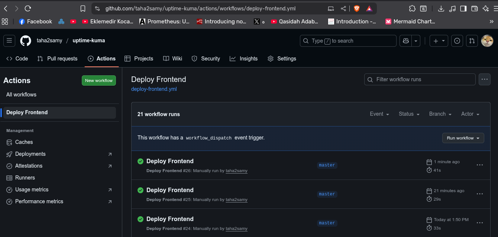
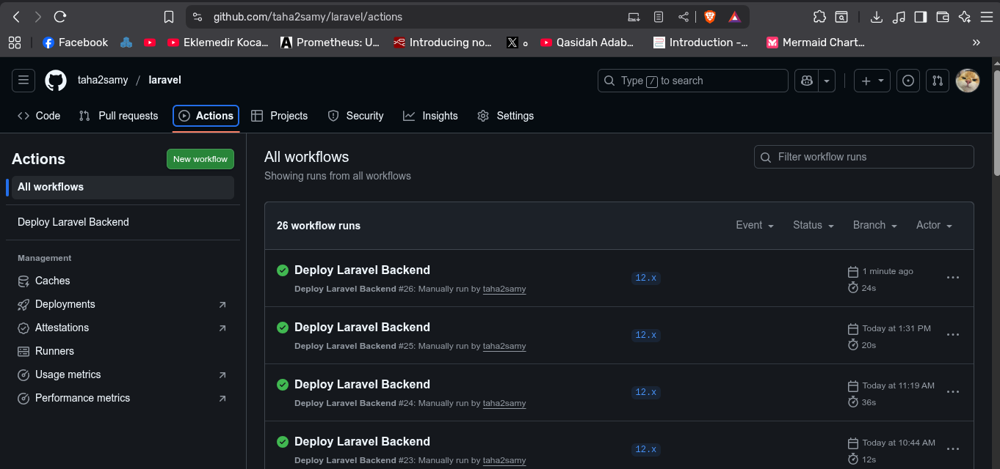
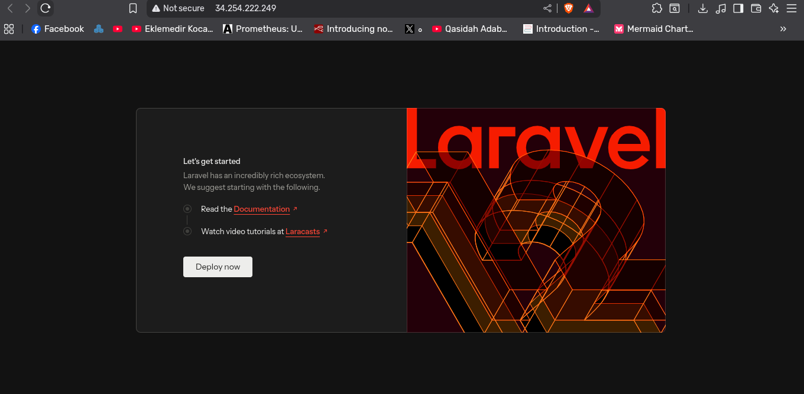

# Task Group B: CI/CD Automation Strategy & Implementation

## 1. Executive Overview
In modern DevOps practices, Continuous Integration and Continuous Deployment (CI/CD) are pivotal for delivering software rapidly and reliably. For the Obelion project, we have architected fully automated pipelines using **GitHub Actions**. These pipelines eliminate manual intervention, ensuring that every commit to the main branches results in a predictable, consistent deployment to the live infrastructure.

This document details the design choices, workflow logic, security mechanisms, and the operational flow for both the Frontend (Uptime Kuma) and Backend (Laravel) applications.

---

## 2. CI/CD Architecture & Security

### 2.1 The "Push-to-Deploy" Model
We adopted a push-based deployment model where the CI server (GitHub Actions Runner) actively connects to the target infrastructure to apply changes. This contrasts with a pull-based model (like GitOps/ArgoCD) but is highly effective and simpler for EC2-based architectures.

### 2.2 Security & Secrets Management
A critical aspect of our automation is security. Hardcoding credentials in code is a vulnerability. Instead, we utilized **GitHub Secrets** to inject sensitive data securely into the runtime environment of the runners.

**Key Secrets Configured:**
*   `SSH_PRIVATE_KEY`: The RSA private key generated specifically for the `ubuntu` user on EC2.
*   `SSH_USER`: The username for the server connection.
*   `DB_HOST`, `DB_DATABASE`, `DB_USERNAME`, `DB_PASSWORD`: Database credentials injected dynamically into the Laravel `.env` file during deployment.

**Variable Management:**
*   `FRONTEND_HOST` & `BACKEND_HOST`: Stored as GitHub **Variables** (non-sensitive) to define the target IP addresses dynamically. This allows the pipeline to adapt if the underlying infrastructure (IPs) changes via Terraform re-provisioning.

---

## 3. Frontend Automation Pipeline (Uptime Kuma)

### 3.1 Objective
The requirement was to automate the deployment of a Dockerized application (Uptime Kuma) whenever changes occur on the `main` branch. The process involves a build simulation followed by a containerized deployment.

### 3.2 Workflow Logic
The workflow is defined in `.github/workflows/deploy-frontend.yml`. It consists of two sequential jobs:

#### **Job 1: Build-Test (Simulation)**
Before deploying, it is crucial to validate the build. Since we are using a pre-built public image from Docker Hub, this step simulates a build process or runs unit tests.
*   **Command:** `echo "Building Frontend..."`
*   **Purpose:** Placeholder for future compile/test steps (e.g., `npm run build` if we were customizing the UI).

#### **Job 2: Deploy**
This job executes only if the "Build" job succeeds. It utilizes the `appleboy/ssh-action`, a standard action for executing remote shell commands via SSH.

**Deployment Steps:**
1.  **Establish SSH Connection:** The runner connects to the Frontend EC2 using the `SSH_PRIVATE_KEY` and the Public IP.
2.  **Environment Preparation:**
    *   Creates the application directory: `/home/ubuntu/uptime-kuma`.
3.  **Docker Compose Orchestration:**
    *   Since the requirement specifies using the public image (`louislam/uptime-kuma`), we do not need to build a Dockerfile locally.
    *   The pipeline creates a `docker-compose.yml` file on the fly on the remote server.
4.  **Container Lifecycle Management:**
    *   `docker-compose down`: Stops and removes old containers to ensure a clean state.
    *   `docker-compose pull`: Fetches the latest image tag from Docker Hub.
    *   `docker-compose up -d`: Starts the service in detached mode, exposing port `3001`.

### 3.3 Evidence of Success
The screenshot below demonstrates the successful execution of the Frontend workflow. Note the green checkmarks indicating that all steps (Build simulation, SSH Connection, Docker Deployment) passed without errors.

Furthermore, accessing the Frontend Public IP on port `3001` confirms the application is live:

---

## 4. Backend Automation Pipeline (Laravel PHP)

### 4.1 Objective
The backend deployment is significantly more complex. It involves deploying a stateful PHP application, managing dependencies via Composer, and, most critically, automating database schema migrations (`php artisan migrate`) on a server that connects to a private RDS instance.

### 4.2 Workflow Logic
The workflow is defined in `.github/workflows/deploy-backend.yml` and triggers on the `12.x` branch (as requested for the Laravel repo).

#### **Job: Deploy-Laravel**

**Step 1: Checkout Code**
The runner checks out the latest code from the repository to ensure it has the context of what needs to be deployed (though the actual code pull happens on the server, the runner needs the workflow file itself).

**Step 2: SSH & Remote Execution**
The core logic resides in a shell script executed remotely on the Backend EC2 instance via SSH.

**Detailed Execution Sequence:**

1.  **Directory & Permissions Setup:**
    *   The script ensures the target directory `/var/www/html/backend` exists.
    *   It fixes ownership permissions (`chown -R ubuntu:ubuntu`) to ensure the CI user has write access, preventing "Permission Denied" errors during file operations.

2.  **Git Operations (The "Pull" Strategy):**
    *   We utilize `git` on the server to pull changes. This is efficient as it only transfers the delta (changed files) rather than uploading the entire artifact every time.
    *   `git config --global --add safe.directory ...`: A necessary security workaround for Git execution in CI environments.
    *   `git pull origin 12.x`: Fetches the latest commits.

3.  **Dependency Management (Composer):**
    *   `composer install --no-dev --optimize-autoloader`: This is a production-grade command. It installs PHP dependencies specified in `composer.lock`, excludes development packages (like testing tools), and optimizes the class loader for performance.

4.  **Environment Configuration (.env):**
    *   This is the most critical security step. The pipeline dynamically generates the `.env` file on the server using the GitHub Secrets (`DB_HOST`, `DB_PASSWORD`, etc.).
    *   This ensures that sensitive production credentials are never committed to the Git repository history.

5.  **Database Migrations:**
    *   `php artisan migrate --force`: This command applies any pending database schema changes (e.g., creating tables, adding columns).
    *   The `--force` flag is mandatory in production mode to bypass the interactive confirmation prompt, ensuring zero-touch automation.

6.  **Application Caching & Optimization:**
    *   `php artisan config:cache`: Combines all config files into a single cached file for speed.
    *   `php artisan route:cache`: Compiles routes for faster dispatching.
    *   `php artisan view:cache`: Compiles Blade templates.

7.  **Service Reload:**
    *   `sudo service nginx reload`: Reloads the web server to serve the new code without dropping active connections.
    *   `sudo service php8.2-fpm reload`: Clears the OPcache so that PHP executes the new scripts immediately.

### 4.3 Handling the Private RDS Connectivity
A common challenge in this topology is running migrations. Since the RDS instance is **Private**, GitHub Actions runners (which are on the public internet) cannot connect to it directly.

**Our Solution:**
We execute the migration command **from within the Backend EC2 instance**.
*   The GitHub Runner SSHs into the Backend EC2.
*   The Backend EC2 *does* have network access to the RDS instance (via the Security Group rules allowing port 3306).
*   Therefore, running `php artisan migrate` locally on the EC2 succeeds securely.

### 4.4 Evidence of Success
The screenshot below confirms the successful deployment of the Laravel application. The logs clearly show the sequence: Git Pull -> Composer Install -> Migration -> Service Reload.

Accessing the Backend Public IP confirms Nginx is serving the Laravel application successfully:

---

## 5. Challenges & Solutions

During the implementation of these pipelines, several technical challenges were encountered and resolved:

### Challenge 1: SSH Host Key Verification
*   **Issue:** When GitHub Actions connects to a new EC2 instance for the first time, it prompts to verify the host key fingerprint, which hangs the automated process.
*   **Solution:** We used the `-o StrictHostKeyChecking=no` option in the SSH command. While slightly less secure against Man-in-the-Middle attacks, it is a standard acceptable trade-off for dynamic cloud environments where IPs change frequently.

### Challenge 2: File Permissions on `/var/www/html`
*   **Issue:** The default `ubuntu` user does not have write access to the web root owned by `root`.
*   **Solution:** We implemented a `chown` step in the Terraform `user_data` script (Infrastructure layer) AND confirmed it in the CI pipeline to ensure the `ubuntu` user owns the deployment directory.

### Challenge 3: Environment Variable Injection
*   **Issue:** Laravel requires a `.env` file to run, but we cannot commit it to Git.
*   **Solution:** We utilized `sed` and `printf` commands within the CI pipeline to construct the `.env` file dynamically using the secrets passed from GitHub.

---

## 6. Conclusion of Task B (Automation)
The implemented CI/CD solution provides a robust, automated path to production. It adheres to DevOps principles by separating configuration (Secrets) from code, automating tedious tasks (Migrations, Composer), and ensuring consistency. The development team can now focus entirely on writing code, knowing that a simple `git push` will handle the complexity of deployment.